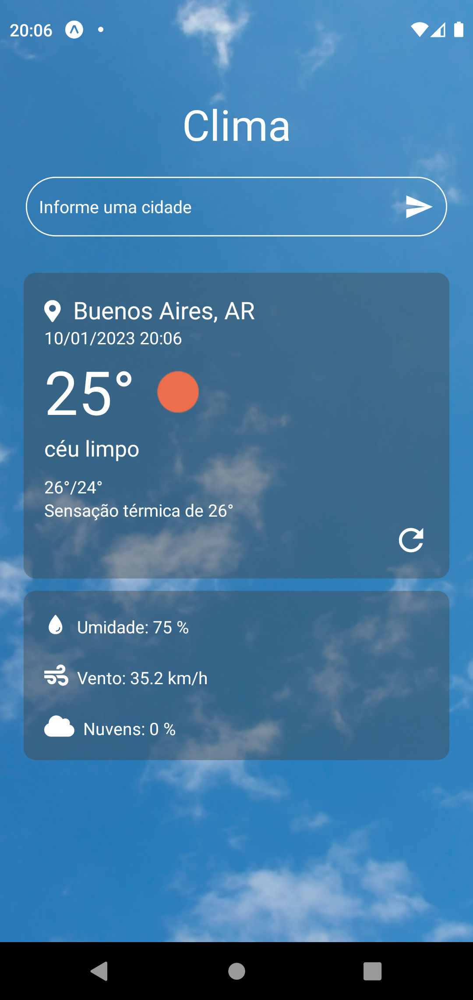
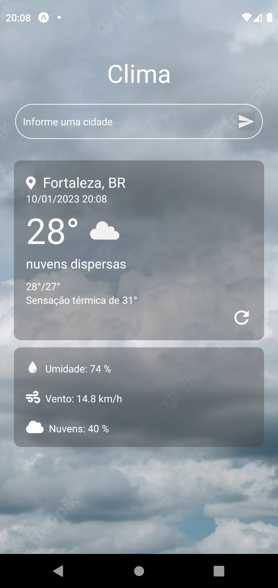
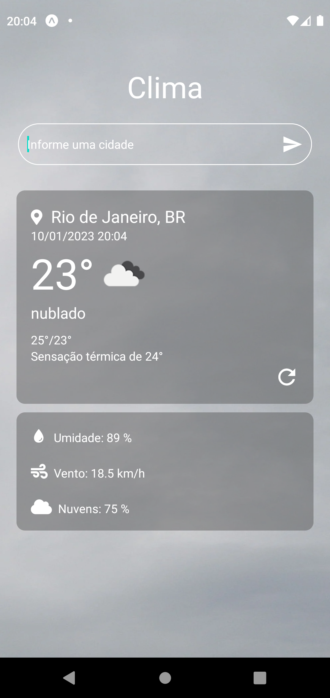

# Weather App

Projeto de aplicativo para mostrar informações sobre o clima atual em cidades que o usuário desejar.

## OpenWeatherAPI

Versão gratuita da OpenWeatherAPI utilizada nesse projeto.

[Clique aqui para acessar](https://openweathermap.org/api)

## Tecnologias

- Javascript
- React Native

## Contato

victor.coelho@outlook.com